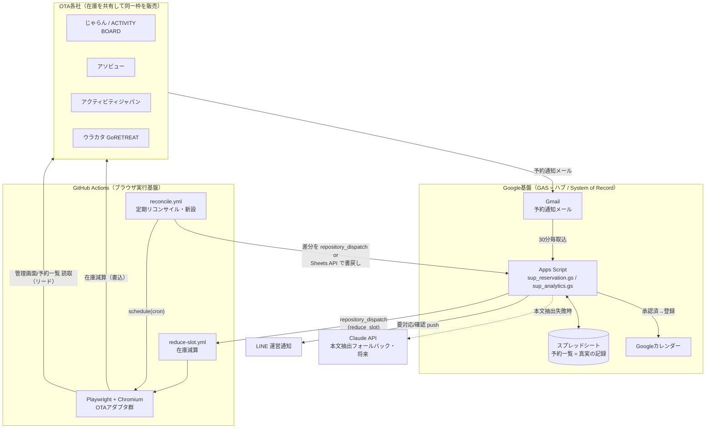

# 03. システムアーキテクチャと定期同期・運用設計

SUP体験事業 予約管理システム / 設計書 Part 3
対象: アーキテクト・SRE・実装者
最終更新: 2026-06-30

本書は現状のコード（`sup_reservation.gs` の `notifySlotReduction_` 周辺 / `automation/reduce-jalan-slot.js` / `.github/workflows/reduce-slot.yml`）の実装を起点に、定期同期（リコンサイル）・マルチOTA拡張・信頼性運用・セキュリティ・段階導入を設計する。

---

## 0. 現状の正確な把握（コードから確認した事実）

実装を読んで確認した、設計の前提となる「いまの事実」を先に固定する。推測ではなくコード根拠を併記する。

| 項目 | 現状の事実 | 根拠 |
|---|---|---|
| メール取込トリガー | `importReservationEmails`（50件）を **30分ごと**、`registerApprovedToCalendar` を **1時間ごと** | `setupTriggers()` |
| 取込対象OTA | じゃらん(activityboard.jp) / アソビュー(asoview.com) / アクティビティジャパン(activityjapan.com) / ウラカタ(urkt.in) | `CONFIG.SEARCH_QUERY`, `parseEmail()` |
| 重複防止 | メッセージID(`COLUMNS.MESSAGE_ID`)で `byMsgId` 判定 + 予約番号で `byBookingNo` 突合 | `loadExistingReservations()` |
| 在庫連携の起動 | 新規 `確定`/`仮予約` のみ `notifySlotReduction_(r)` を呼ぶ。更新・キャンセル時は呼ばない | `importEmails_()` L143-145 |
| 在庫連携の安全弁 | `SLOT_SYNC_ENABLED==='true'` のときだけ実行（既定OFF）。`SLOT_SYNC_DRY_RUN` 既定 `'true'` | `notifySlotReduction_()` L537, L575 |
| 自サイト除外 | `r.site` に「じゃらん」を含む予約は **じゃらん枠を減らさない**（自分の売り元は触らない） | L556-559 |
| 連携経路 | GAS → `POST /repos/{owner}/{repo}/dispatches`（`event_type: reduce_slot`） → GitHub Actions | `notifySlotReduction_()` / workflow `repository_dispatch` |
| Actions payload | `slot_date(YYYY-MM-DD)` / `slot_time(HH:MM)` / `slot_decrement` / `dry_run` / `source_site` | `client_payload` |
| Playwright操作 | AirIDログイン→店舗選択→予約・販売管理→**時間(行)×日付(列)マトリクス**で対象セル特定→`.stepper-button-minus` をクリック減算 | `reduce-jalan-slot.js` |
| セル特定の鍵 | 日付列=`span.day`(`"6/30"`)、行=`.time`(`"10:00 ～ 12:00"`)、残数=`.stock-cnt`、減算=`.stepper-button-minus` | L159, L193-216, L218 |
| Playwright安全弁 | DRY_RUN既定ON / 行時間・列日付の一致照合 / `MAX_DECREMENT`(既定10) / 減算前後の残数検証 / エラー時スクショ | ヘッダコメント L16-19, `assertConfig()` |
| 失敗時の証跡 | `error-screenshot.png` を `if: failure()` で artifact アップロード | workflow L46-52 |

**重要な現状ギャップ（後段の設計で埋める対象）**
1. **書き込み（GAS→OTA）専用**で、**読取り（OTA→GAS）の経路が無い** → メール取りこぼし時に在庫・予約状態が永久にズレる。
2. 在庫を減らすのは**じゃらんのみ**。他3OTA(アソビュー/アクティビティジャパン/ウラカタ)への減算は未実装。
3. `notifySlotReduction_` は**メール起点の一方向 push**。冪等性キー（予約番号）を Actions 側に渡しておらず、再実行で**二重減算**の恐れ。
4. UI変更検知が**エラー時スクショのみ**（能動監視なし）。セレクタが変わると「見つからず return（成功扱い終了）」する箇所があり、**サイレント失敗**になりうる（`locateDateColumn` で見つからず `return` → exit 0）。

---

## 1. 全体アーキテクチャ

### 1.1 なぜこの構成か（設計判断）

- **GAS をハブにする理由**: Gmail / スプレッドシート / カレンダー / LINE が全て Google/HTTP API で完結し、サーバ管理不要・無料枠・時間トリガーが使える。予約の「真実の記録（System of Record）」はスプレッドシートに集約する。
- **ブラウザ操作を GitHub Actions に委譲する理由**: GAS は**ヘッドレスブラウザを実行できない**（Playwright/Chromium不可）。OTA管理画面はAPIが無くUI操作が必須なため、ブラウザを動かせる実行基盤が別途必要。GitHub Actions は無料枠・Secrets管理・artifact・cron(`schedule`)・`repository_dispatch` を備え、追加インフラなしでこの役割を満たす。
- **GAS→Actions を `repository_dispatch` にする理由**: GAS から `UrlFetchApp` で叩ける単純なHTTP POSTで、イベント駆動（予約発生時のみ起動）にできる。常駐サーバ不要。
- **Claude API の位置づけ**: 現状コードでは未使用だが、スクリプトプロパティ `ANTHROPIC_API_KEY` が確保済み。将来、正規表現で取りこぼすメール本文の構造化抽出（パーサのフォールバック）に使う想定。

### 1.2 構成図



### 1.3 データフロー（2系統）

**A. 書込フロー（既存・イベント駆動）**
```
他OTAで予約 → 通知メール → Gmail → GAS importEmails_()
  → スプレッドシートに追記（真実の記録を更新）
  → 新規 確定/仮予約 かつ 非じゃらん → notifySlotReduction_()
  → repository_dispatch(reduce_slot) → Actions → Playwright → じゃらん在庫 -N
```

**B. 読取フロー（新設・定期リコンサイル / 第2章）**
```
cron（例: 6h毎）→ Actions reconcile.yml → Playwright で各OTA管理画面を読取
  → 「OTA上の実予約・実残数」を取得
  → スプレッドシート（真実の記録）と突合
  → 差分（取りこぼし予約 / 在庫ズレ）を検出
  → 是正（Sheets追記 + LINE通知 + 必要なら在庫補正）
```

---

## 2. 定期リコンサイル（メール取りこぼし対策）

### 2.1 目的
メール取込は `GmailApp.search` 依存で、配信遅延・誤フィルタ・パーサ未対応フォーマットで**取りこぼし**が起きる。OTA管理画面を**真実の照合源**として定期的に読み、スプレッドシートと突合・是正する。

### 2.2 読取対象・頻度

| OTA | 読取対象画面 | 取得項目 | 備考 |
|---|---|---|---|
| じゃらん | 予約・販売管理の予約一覧、在庫マトリクス | 予約番号/日時/人数/状態、各枠の残数 | 在庫は既存 `.stock-cnt` 再利用 |
| アソビュー | 予約管理一覧 | 予約番号/日時/人数/状態 | アダプタ新規 |
| アクティビティジャパン | 予約管理一覧 | 同上 | アダプタ新規 |
| ウラカタ | 予約管理一覧 | 同上 | アダプタ新規 |

**頻度（推奨）**
- 予約リコンサイル: **6時間ごと**（cron `0 */6 * * *`、JST考慮で `TZ` 明示）。直近30日分の予約を対象。
- 在庫リコンサイル: **1日1回（早朝）**。全枠の残数を「あるべき値」と突合。
- 繁忙期は手動 `workflow_dispatch` で随時。

> 頻度はOTA管理画面の負荷とログイン頻度の兼ね合い。過度なログインはアカウントロック/不正検知リスクがあるため、最短でも**1〜2時間に1回まで**に制限する（第4章レート制御）。

### 2.3 差分検出ロジック

照合キーは **`(OTA, 予約番号)`**。スプレッドシートは既に `byBookingNo` を持つ（`loadExistingReservations`）。リコンサイルはこの逆方向（OTA側→Sheet）で突合する。

```text
入力: ota_reservations[]（OTA管理画面から取得）
      sheet_reservations[]（スプレッドシートの非キャンセル行）

for each o in ota_reservations:
  s = sheet.findByBookingNo(o.bookingNo)
  if s is null:
      => MISSING（取りこぼし）: Sheetに新規追記 + LINE「取りこぼし検出」通知
  else if normalize(s) != normalize(o):  # 日時/人数/状態の差
      => DRIFT（内容ズレ）: 差分項目をLINE通知し、対応メモに記録（自動上書きは慎重に）
  else:
      => OK

for each s in sheet_reservations where status != 'キャンセル':
  if s.bookingNo not in ota_reservations(by site):
      => GHOST（OTA側に無い）: OTAでキャンセル済の可能性 → LINEで要確認通知

# 在庫リコンサイル
for each slot(date,time) in horizon:
  expected = limit - sum(active people in sheet for that slot)   # getSlotCapacity と同ロジック
  actual   = read .stock-cnt from OTA
  if abs(expected - actual) > 0:
      => STOCK_DRIFT: LINE通知（自動補正は dry_run 経て段階導入）
```

**正規化（`normalize`）**: 日付は `YYYY-MM-DD`（`normalizeSlotDate_` 流用）、時刻は `HH:MM`（`normalizeHm` 流用）、人数は整数化。これにより `"2026/8/14"` と `"2026-08-14"` 等の表記揺れを吸収。

### 2.4 是正方針（安全側）
- **MISSING**: 取りこぼしは事業影響大 → Sheet自動追記は許容（人手より安全）。ただし在庫減算は**自動では行わず**LINE通知に留める（二重減算回避）。
- **DRIFT / GHOST / STOCK_DRIFT**: いきなり自動上書きせず、**まず通知**。`RECONCILE_AUTOFIX` フラグ（既定OFF）で段階的に自動是正を有効化。
- 是正アクションは全て**冪等**にする（同じ差分を2回流しても二重処理しない＝予約番号＋差分種別をキーに記録）。

### 2.5 書戻し経路
2案。**初期はB案を推奨**（既存の repository_dispatch 経路と疎結合）。
- A案: Actions から Google Sheets API（サービスアカウント）で直接書込。低遅延だが資格情報追加。
- **B案**: Actions が差分JSONを artifact 出力 + GAS側 `reconcileFromActions()` を別トリガーで実行し結果を取り込む。資格情報追加なしだが反映に遅延。

---

## 3. マルチOTA在庫同期の拡張設計

### 3.1 共通アダプタインターフェース
サイト固有のUI操作を**アダプタ**に隔離し、オーケストレータ（共通処理：起動・照合・安全弁・ログ）から呼ぶ。現状の `reduce-jalan-slot.js` を「じゃらんアダプタ」に再構成する。

```text
automation/
  core/
    orchestrator.js      # 引数/環境変数解釈・安全弁・ログ・スクショ・リトライ（共通）
    types.js             # SlotKey, ReservationRecord などの型・正規化(normalizeHm/Date)
  adapters/
    jalan.js             # 現 reduce-jalan-slot.js をクラス化（span.day / .time / .stock-cnt / .stepper-button-minus）
    asoview.js
    activityjapan.js
    urakata.js
  config/
    sites.json           # サイトごとの設定を外部化（後述）
  reduce-slot.js         # エントリ: site を見て adapter を選びreduce()
  reconcile.js           # エントリ: 全/指定サイトで read系を呼ぶ
```

```ts
// 各アダプタが実装する共通インターフェース（擬似）
interface OtaAdapter {
  readonly site: string;
  login(page): Promise<Ctx>;                 // 認証（2FA対応含む）
  openManagement(ctx): Promise<MngPage>;     // 管理画面へ遷移
  // --- 書込（在庫減算）---
  locateSlotCell(mng, slotKey): Promise<Cell | null>;  // 日付列×時間行の特定
  readStock(cell): Promise<number | null>;
  decrement(cell, n, {dryRun, maxDec}): Promise<DecResult>;
  // --- 読取（リコンサイル）---
  listReservations(mng, {fromDate, days}): Promise<ReservationRecord[]>;
  readStockMatrix(mng, {fromDate, days}): Promise<StockCell[]>;
}
```

オーケストレータが提供する共通機能（アダプタは書かない）:
- 引数/環境変数の検証（`assertConfig` 相当）、`MAX_DECREMENT` 上限、DRY_RUN。
- 減算前の「行時間・列日付の一致照合」と前後残数検証（現 jalan のロジックを共通化）。
- スクショ・構造化ログ・リトライ・レート制御。

### 3.2 設定の外部化（`sites.json`）
セレクタ・URL・上限を**コードから分離**し、UI変更時にコード修正不要にする。

```jsonc
{
  "jalan": {
    "enabled": true,
    "topUrl": "https://activityboard.jp/",
    "auth": "airid",                      // 認証方式
    "credentials": { "id": "JALAN_ID", "password": "JALAN_PASSWORD" }, // Secrets名
    "shopName": "のみくい処 七ツ家",
    "selectors": {
      "dateHeader": "span.day",
      "nextButton": ".calendar > div:nth-child(3) > .action-link",
      "timeRow": ".time",
      "cellList": ".calendar ol > li",
      "stockCnt": ".stock-cnt",
      "minus": ".stepper-button-minus"
    },
    "limits": { "maxDecrement": 10, "maxWindowAdvance": 30 }
  },
  "asoview":       { "enabled": false, "topUrl": "...", "credentials": {"id":"ASOVIEW_ID","password":"ASOVIEW_PASSWORD"}, "selectors": { } },
  "activityjapan": { "enabled": false, "credentials": {"id":"AJ_ID","password":"AJ_PASSWORD"}, "selectors": { } },
  "urakata":       { "enabled": false, "credentials": {"id":"URKT_ID","password":"URKT_PASSWORD"}, "selectors": { } }
}
```

- 既存 `DATE_HEADER_SELECTOR` 等の環境変数オーバライドは**移行期の互換**として残し、最終的に `sites.json` に集約。
- `enabled:false` のサイトはオーケストレータがスキップ → 横展開を**1サイトずつ安全に有効化**できる。

### 3.3 「どのサイトを減らすか」の判定（多重在庫の核心）
同一枠を複数OTAで販売しているため、1件の予約が入ったら**売り元以外の全OTA**を減らすのが原則。

```text
target_sites = ALL_ENABLED_OTA - source_site
# 例: アソビューで予約 → じゃらん/アクティビティジャパン/ウラカタ を各 -N
```

現状 `notifySlotReduction_` は「じゃらんのみ・じゃらん発は除外」という固定ロジック（L556）。拡張時は **`client_payload` に `target_sites` を含める**か、Actions側で `sites.json` の `enabled` から `source_site` を引いて算出する。`source_site` は既に payload にある（L576）ので Actions 側算出が容易。

---

## 4. 信頼性・運用（SRE）

### 4.1 認証情報の管理とローテーション
| 資格情報 | 保管先 | ローテーション方針 |
|---|---|---|
| LINE_*, ANTHROPIC_API_KEY, GITHUB_TOKEN, GITHUB_REPO | GAS スクリプトプロパティ | GITHUB_TOKEN は**90日**で更新。可能なら Fine-grained PAT（`repo`不要、`contents:read`+ `dispatch` 相当の最小）か GitHub App。 |
| JALAN_ID/PASSWORD（+ 追加OTA資格情報） | GitHub Secrets | OTAパスワード変更時に即更新。共有アカウントは避け、専用ログインを用意。 |

- PATは**期限付き**を必須化し、期限7日前にカレンダー/LINEでリマインド（`sup_analytics.gs` の週次レポートに「資格情報期限」を載せる）。

### 4.2 2FA対策
OTA管理画面が2FA/SMS/CAPTCHAを要求するとヘッドレス自動化が破綻する。対策（優先順）:
1. **セッション再利用**: ログイン済みの `storageState`（Cookie/localStorage）を暗号化して Secrets/暗号化artifactに保存し、Playwrightで読み込む。2FAはセッション有効期間中は回避。期限切れ時のみ手動再ログイン。
2. **TOTP自動入力**: TOTPシークレットをSecretsに置き、`otplib` 等でコード生成（SMS/メールOTPは不可）。
3. **手動介入フォールバック**: 2FA突破不能を検知したら**処理中止 + LINEで「要手動操作」通知**（サイレント失敗にしない）。

### 4.3 UI変更の検知（最重要・現状の穴）
現状、`locateDateColumn` で日付が見つからないと `return`（exit 0＝成功扱い）になり**サイレント失敗**する。対策:
- **失敗の明示化**: 「対象セルが見つからない」「`.stock-cnt` 不在」を**異常終了(`exitCode=1`)** とし、`if: failure()` のスクショ/通知に乗せる。
- **セレクタ健全性チェック（カナリア）**: リコンサイルとは別に **1日1回 `selector-health` ジョブ** を走らせ、`span.day` / `.time` / `.stock-cnt` / `.stepper-button-minus` 各セレクタの**ヒット数**を検証（例: `span.day` が14個前後あるか）。0件や想定外の数なら **UI変更疑い** としてLINE通知。
- **スクショ比較（任意）**: 管理画面の基準スクショと当日スクショをピクセル差分（`pixelmatch`）で比較し、閾値超で警告。レイアウト変更の早期検知に有効。

### 4.4 失敗時アラートとリトライ
- **リトライ**: ネットワーク/タイムアウト等の一時障害は**指数バックオフで最大3回**（オーケストレータが担当）。ただし「減算クリック」は**冪等でない**ため、**減算ステップはリトライしない**（前後残数検証で「既に減っている」なら成功扱い）。
- **二重減算防止（冪等性）**: `client_payload` に **`dedup_key = {source_site}:{bookingNo}`** を追加し、Actions側で「処理済みキー一覧」（artifact もしくは Sheetの専用列）と突合。既処理ならスキップ。現状これが無いため**最優先で追加**。
- **アラート**: 失敗時は GAS の LINE通知経路を再利用。Actionsから失敗を通知するには (a) 失敗ステップで LINE Webhook を直接叩く、(b) `repository_dispatch` で GAS に通知、のいずれか。**(a) を推奨**（経路が短い）。

```yaml
# workflow 失敗通知の例（reduce-slot.yml に追記）
      - name: Notify failure to LINE
        if: failure()
        env: { LINE_TOKEN: ${{ secrets.LINE_CHANNEL_TOKEN }}, LINE_USER: ${{ secrets.LINE_USER_ID }} }
        run: |
          curl -s -X POST https://api.line.me/v2/bot/message/push \
            -H "Authorization: Bearer $LINE_TOKEN" -H "Content-Type: application/json" \
            -d "{\"to\":\"$LINE_USER\",\"messages\":[{\"type\":\"text\",\"text\":\"⚠️ 在庫同期Actions失敗: ${{ github.run_id }}\"}]}"
```

### 4.5 実行ログの保存
- Playwright の構造化ログ（開始/特定/前後残数/結果）を **JSON Lines** で出力し、成功・失敗ともに artifact 保存（現状は失敗時スクショのみ）。
- artifact 保持は **30〜90日**。長期は Sheetの「在庫操作ログ」シートに1行サマリ追記（誰がいつどの枠を±いくつ操作したか監査可能に）。

### 4.6 レート制御
- 1ワークフロー実行あたりのOTAアクション間に **0.5〜1秒のwait**（既存 `waitForTimeout(500)` 踏襲）。
- **同時実行抑止**: workflow に `concurrency: { group: ota-sync, cancel-in-progress: false }` を設定し、減算とリコンサイルが**同一OTAに同時ログイン**しないようにする（セッション競合/ロック回避）。
- ログイン頻度上限: リコンサイルは最短でも1〜2時間に1回（4.2のセッション再利用で実ログイン回数を削減）。

---

## 5. セキュリティ

- **保管**: 秘密は GAS スクリプトプロパティ / GitHub Secrets のみ。**コード・ログ・スクショ・artifactに平文で残さない**。`sites.json` には**Secrets名のみ**を書き、値は書かない（3.2の設計どおり）。
- **最小権限**:
  - GITHUB_TOKEN は Fine-grained PAT で対象リポジトリのみ・必要スコープのみ（理想は GitHub App）。現状 `repo` 全権は過剰。
  - LINEは push 専用チャネル。Sheets API を使う場合はサービスアカウントに該当スプレッドシートのみ共有。
- **ログ衛生**: ログ出力時に `JALAN_PASSWORD` 等を**マスク**（Actionsは Secrets を自動マスクするが、自前ログでも `***` 置換を徹底）。**スクショに資格情報入力画面を含めない**（ログイン後の管理画面のみ撮影、パスワード欄が写る前のショットは撮らない）。
- **DRY_RUN ゲート**: 本番在庫を触る操作は `SLOT_SYNC_ENABLED` + `DRY_RUN=false` の**二重ゲート**を維持（現状の安全側既定を踏襲）。
- **入力検証**: `client_payload` は外部入力とみなし、`slot_decrement` の上限(`MAX_DECREMENT`)・日付/時刻フォーマットを Actions 側でも再検証（GAS側検証を信用しすぎない）。
- **artifact**: 差分JSON等に個人情報（氏名/連絡先）を含める場合は保持期間を短く（7日）、リポジトリは**private**前提。

---

## 6. 段階的ロードマップ

| 段階 | 内容 | 完了条件（Done） |
|---|---|---|
| **P0: 現状PoC（済）** | じゃらん枠の手動/dispatch減算、DRY_RUN | `workflow_dispatch` で対象セル特定・前後残数ログが出る（実装済） |
| **P1: 本番化（じゃらんのみ）** | 二重減算防止(dedup_key)、UI変更でのサイレント失敗を異常終了化、失敗LINE通知、ログartifact常時保存、PATを期限付き最小権限へ | `DRY_RUN=false` で実枠が正しく減る／失敗時にLINEが届く／同一予約再dispatchで二重減算しない／セレクタ不在で必ず赤くなる |
| **P2: セレクタ健全性監視** | `selector-health` ジョブ（1日1回）でセレクタ数検証＋通知、（任意）スクショ比較 | UIを意図的に変えたテストで翌実行までにLINE警告が出る |
| **P3: マルチOTA横展開** | `core/adapters` 構成へ再編、`sites.json` 外部化、アソビュー→アクティビティジャパン→ウラカタの順に `enabled` 化、target_sites算出 | 1サイトずつDRY_RUN→本番化。各サイトで前後残数検証が通る／売り元除外が正しい |
| **P4: 予約リコンサイル** | `reconcile.js` + cron(6h)。OTA予約一覧読取→Sheet突合→MISSING自動追記＋DRIFT/GHOST通知 | 故意に1件メール取込を止めても、次リコンサイルでSheetに補完＋LINE通知される |
| **P5: 在庫リコンサイル/自動是正** | 残数突合(1日1回)、`RECONCILE_AUTOFIX` で段階的自動補正、2FAセッション再利用 | 在庫ズレを検出・通知。AUTOFIX ONで安全に補正（dry_run検証後） |
| **P6: 運用成熟** | 監査ログシート、資格情報期限の週次レポート連携(`sup_analytics.gs`)、SLO定義（取りこぼし0件/週、同期失敗率<1%） | 週次レポートに同期状況・期限・失敗率が出る |

各段階は**前段の完了条件を満たすまで次に進まない**。特に P1（二重減算防止・サイレント失敗の解消）は本番在庫を触る前の必須ゲート。

---

## 7. 未決事項・要確認事項・リスク

**未決事項（要意思決定）**
- リコンサイルの書戻し経路を A案(Sheets API/サービスアカウント) か B案(artifact+GAS) のどちらにするか。→ 初期はB案推奨だが反映遅延を許容できるか要確認。
- MISSING（取りこぼし）検出時、在庫減算まで自動でやるか／通知に留めるか。→ 二重減算リスクとのトレードオフ。
- 多重在庫の「減らす対象」算出を Actions側で行うか GAS側 payload で渡すか。

**要確認事項（実装前に現物確認が必要）**
- アソビュー/アクティビティジャパン/ウラカタの管理画面URL・**ログイン方式（2FA有無）**・予約一覧/在庫UIのセレクタ（じゃらん同様の録画によるセレクタ確定が必要）。
- じゃらんの `NEXT_BUTTON_SELECTOR`（`.calendar > div:nth-child(3) > .action-link`）は録画ベースの推定。実環境で安定するか要再確認。
- 各OTAアカウントの**自動ログインに対する規約**（ロボット操作の可否・レート上限）。規約違反/アカウントロックの法務・運用リスク。
- OTAの予約一覧で「予約番号」がメール上の `bookingNo` と一致するか（突合キーの整合性）。アソビューは `reserveNo` 等表記が異なる可能性。

**リスク**
- **二重減算（最大リスク）**: dedup未実装の現状で本番化すると、再dispatch・リトライで在庫を過剰に減らす。P1で必ず解消。
- **サイレント失敗**: セレクタ不一致時に exit 0 で「成功」扱いになり、在庫が減らないのに気づけない。P1/P2で異常終了化＋監視。
- **2FA/CAPTCHA導入**: OTA側仕様変更で自動化が突然停止しうる。セッション再利用＋手動フォールバックで影響を限定。
- **UI変更の連鎖**: 4サイト分のセレクタを抱えると保守コストが増大。`sites.json` 外部化と健全性監視で運用負荷を抑えるが、ゼロにはならない。
- **アカウントロック**: 高頻度ログイン/誤操作検知でOTAアカウントが凍結されると販売停止＝事業影響大。レート制御・セッション再利用を厳守。
- **GASクォータ**: `UrlFetchApp` / トリガー実行回数の無料枠上限。予約急増時に取込遅延の可能性。
